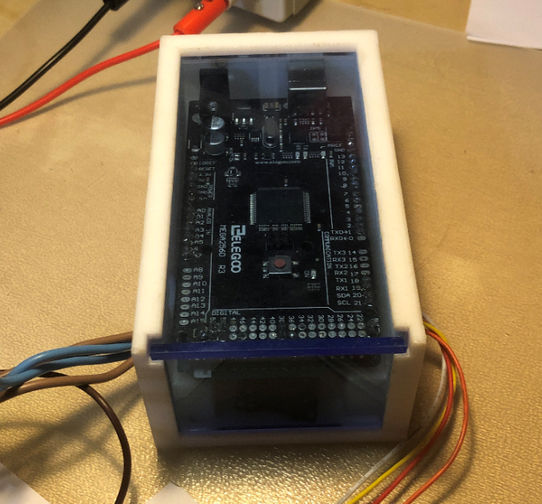
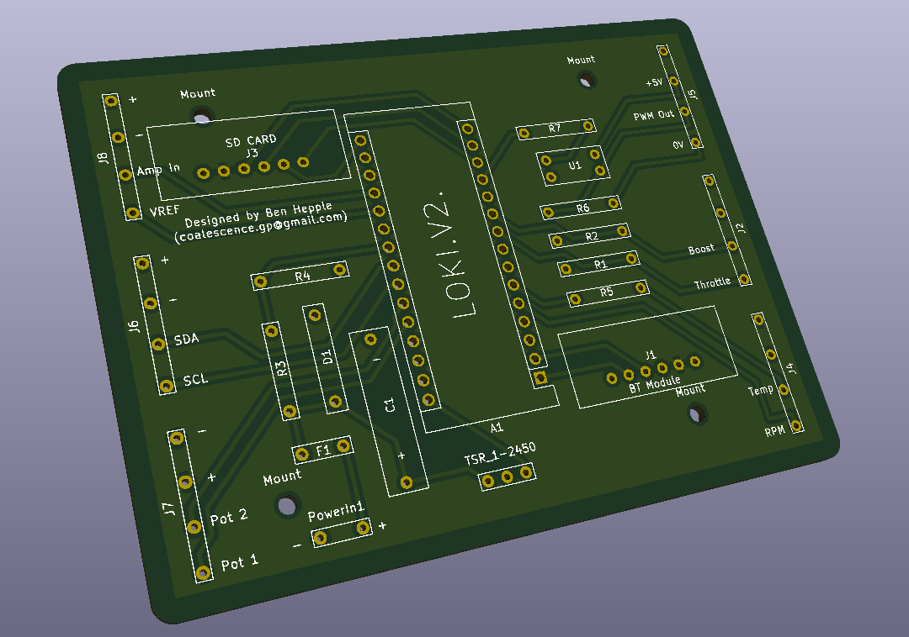

# LOKI
Developement of telemetry and data collection using a microcontroller (Arduino, ESP32 etc) to output a PWM signal to a speed controller such as the 4QD porter 5/10. 

In this repository you will find incremental developement to find the best solution to operating and using 24V DC batteries and motor as found on the Greenpower (www.greenpower.co.uk) regulations page. 
Electronics (Loki Board) and the software is free of licence, however, the board will be made available to purchase directly from me as a private agreement. 
(email: coalescence.gp@gmail.com), but feel free to try and have a good hack at it ;). 

# History:
Back in 2019 I had started my A-level in Design Technology and wanted to create a product that would allow better team communication, this eventually transpired to making a battery status monitor that beamed an 433MHz signal to the pitlane during the races. The voltage was found using a potential divider on a raspberry Pi and the string was encoded into a Hex signal which then used precise timers to create the packets needed to allow AM carrier transmition. 

This was a massive headache, clunky and inefficient (But I got the A* i needed hehe). 

In March 2020, during the covid-19 pandemic, I suddenly found that I had plenty of time to think of a better solution, which was when I started to research about hobbiest electronics and microcontrollers such as the arduino. They offered a more efficient/code logic rather than using logic gates to encode data. Also, having a microcontroller allowed for more data to be gathered, which was the moment I realised much, much more could be achieved. Since then I have been developing sensor data based circuits that can monitor a greenpower cars 'vital systems'. In July 2020 I was no longer a member of BGS Greenpower (Bristol Grammar School) and I joined a close friend's team called Coalescence GP which included his first car Icarus. With a new team and direction I set about making the next car monitoring system.

The first version of this was called T2W (The Thrust Weapon, don't ask why) and while it was rigged with glitches and poor design ethos it did the job and in september of 2020 gave us some valuable current vs time data, saved to an SD card, which is arguably the most important data you can collect. There was capability to gather voltage, Temperature, and RPM, but a lack of a solid testing environment due to COVID meant it was the first time the board was being used in that environment. But still I was determined to get a better understanding of the potential microcontrollers offered.

Loki is my latest developent of this journey, and is the design I hope to iterate on over at least the next 2 years. I will be developing it in parallel with my course at university and will deploy updates and provide active support to anyone who wishes to use the board. 

# Board features:
Firstly, it cannot be ignored that anyone who has previously looked at different option for adding data telemetry and monitoring of systems has more than likely come across the WeChook racing fellas who developed a very realiable system called the Echook Nano which is arguably the most widely used kit that fulfills this purpose. It offers pretty much the exact same features as LOKI, but having been in development for many years now it does offer a more tried and relaible system. The Echook Nano documentaion (https://docs.echook.uk/), has offered me with plenty of wisdom and I have also spoken to the very active developers to confer with them over design choices for LOKI, so they only have my graditude and I have no intention of competing with them (don't think I could even if I tried to be honest). However, didn't stop me from trying to make my own custom board that fulfills my own specification and allows me to tailor it to my needs. All in all, thanks Rowan :D

**Features included:**

**Current sensing** up to 150 amps with a resolution of 0.25A (Could be improved with an Op Amp :/ )

**Battery voltage** reading (Max 30V as there is a 1/6 ratio to step down to the 5V arduino Pin )

**Motor RPM** (This is done using an infrared variable distance circuit that triggers an external interrupt on the board)

**Motor Temperature** (This only samples the temperature with a very high accuracy every 6 seconds because does take considerable processing power)

**Race Time** (Only records the time since the board was switched on. So if the +24V into the board is turned off when the car is turened of the clock will reset)

**Data Logging** ( saves all the above data into a text document, with each variable seperated by a comma which excel loves :) )

**Bluetooth Extension** (A bit of a last ditch addition, there is no functionality in the software to use this currently, but it's there incase you wish to develope that yourself)

**2 Button inputs** (Named on the board as Throttle and Boost, This can be configured as other functions if you are using a Variable throttle)

**2 Variable throttle or ADC ports** (These are left spare so addition sensors or a twist grip throttle can be added onto the board where required (some exceptions will apply)).

**For more information please open the PDF in the Main commit**

