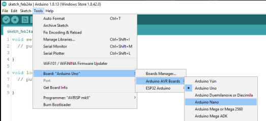
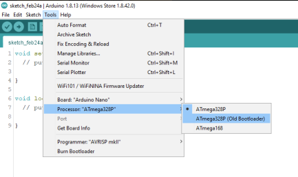
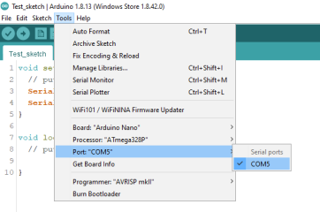

# Software

## Introduction

In this section I will break down key parts of the arduino code that power the Loki board. If there are parts you are unsure about after having read this section please do not hesitate to drop us an email.

Also, if you plan to 'hack' the code for your own use and want to know how to change the code without any knock on effects afterwards then feel free to give me a shout :\) 

## Arduino IDE structure

Arduino boards can be programmed using many IDE's \(Integrated Development Environment - software used to code, format, check and compile\), but the LOKI board has been entirely programmed using the Arduino IDE which can be downloaded here: [https://www.arduino.cc/en/software](https://www.arduino.cc/en/software) 

Other software that more experienced programmers could use is Visual studio, notepad++ \(I use this quite often\) or node red etc.  But these do require plugins to properly compile the code into the Arduino's boot memory. However, it can be beneficial to do most the coding in an IDE like notepad++ that has more advanced error checking and GUI to get the bulk of the work done and then port the code \(Copy and paste\) to the Arduino IDE to then check it compiles. There isn't really a right or wrong way. 

## Using the IDE to upload

After you have compiled your current version of the code and wish to upload it to the board you need to make sure the IDE is able to detect the Arduino. I will only explain this for the Arduino Nano that is currently used in LOKI. These boards use a 'Mini USB' form factor cable to upload, this is a crucial tool. 

Various Arduino Nano's are developed by Arduino and third party companies as they are open source, just like Loki. Some boards will use different USB drivers but 90% of the time the usb driver used will be the CH340 IC which may mean you need to download some USB drivers to your PC. This is a good tutorial directly related to the chip used: [https://youtu.be/MM9Fj6bwHLk](https://youtu.be/MM9Fj6bwHLk)

### Step 1:

First, make sure the board type is set to 'Arduino Nano' and not the default 'Arduino Uno'. This is important as the IDE will not use the correct bootloader for this board. 

### Step 2:

Once you have selected the correct board, you should then get an extra option to choose which processor to use. If you have older/ third party Arduino Nano's it is often the case you need to select 'ATmega328P\(old bootloader\)'. Otherwise you can select the default 'ATmega328P'. 

### Step 3:

You are now ready to connect to the board! However, there is one more step before you can select the upload button. As seen below, once you connect the board to your PC, the 'Port' drop down section should become available, and if everything has been set up correctly the IDE should recognise the board along with type of board on which COM port you have connected the USB cable.

And that's it! You should be ready to install your software to the LOKI board. If you encounter problems with this the first time it will more than likely be the CH340 Drivers being a pain so give that youtube video a watch ;\)

