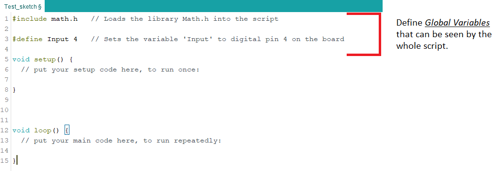

# IDE Layout

The Arduino IDE is split into 3 main sections, initialisation, Setup and Loop. Together these define where parts of you code can go and what order the code will be operated on. 

It is fundamental to understand these sections when making any changes to the code. If you already know what each of these do then skip this page.

### Initialisation 

